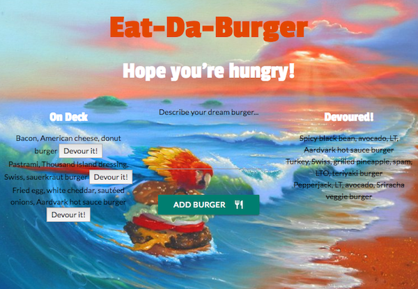

<h1 align="center">Eat-Da-Burger 2: Sequelized!</h1>
A "restaurant app" that lets users input the names of burgers they'd like to eat, then devour each burger with a click of a button. Now featuring Sequelize.

## Technologies Used
* Sequelize, Node.js, Express, MySQL, Handlebars, & Materialize CSS
* Uses MVC (Model, View, Controller) structure

### Deployed Link
[Heroku] Link here.

### Key Features
* User text inputs (burgers) are saved to a MySQL database
* Burgers saved to the database are persistent, "devoured" or not
* HTML and CSS are rendered using Handlebars views and partials

### Screenshots
<!-- 
 
Background image by <a href="http://jimwarren.com/">Jim Warren</a> -->